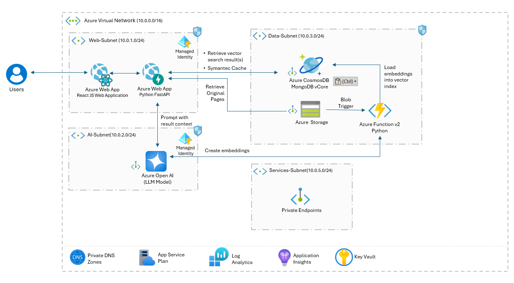
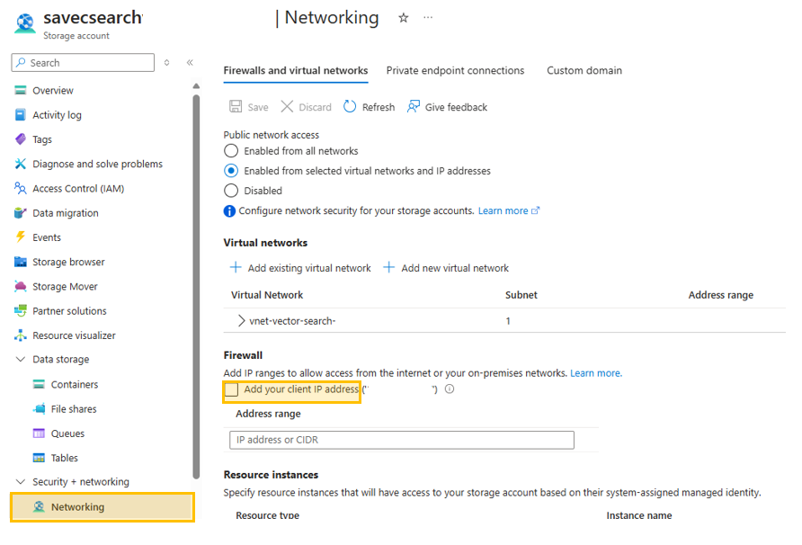
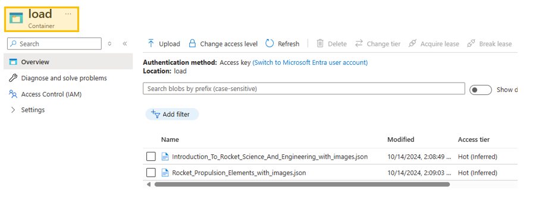
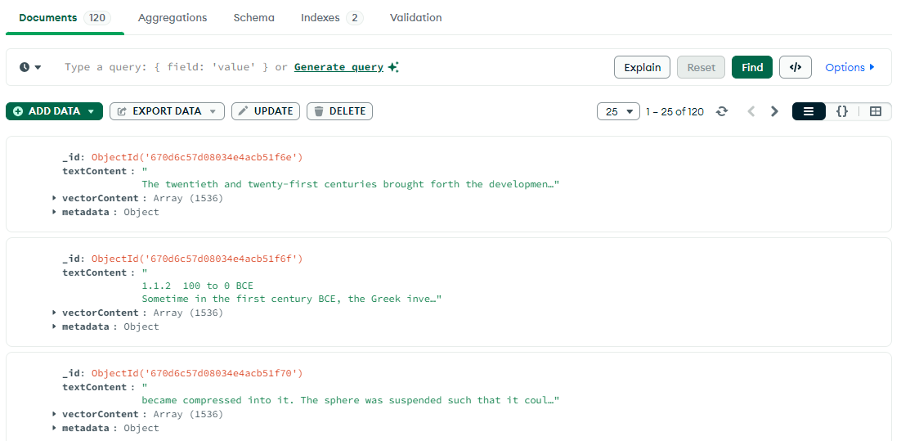
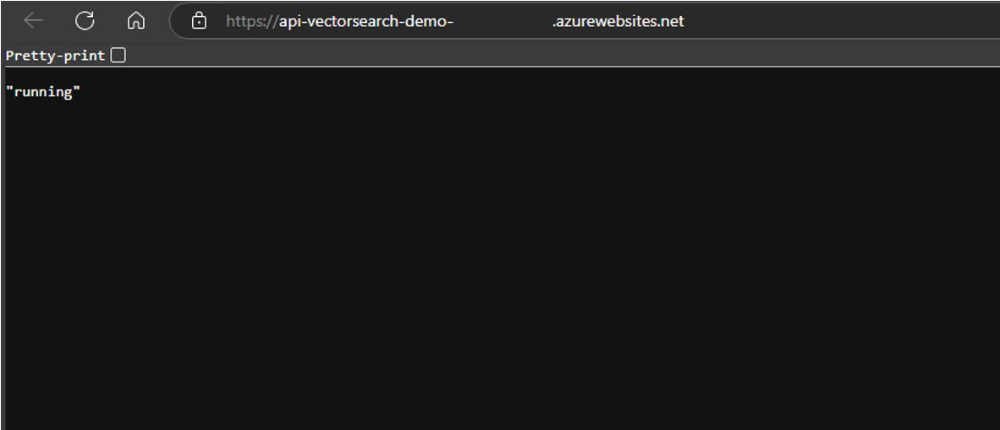
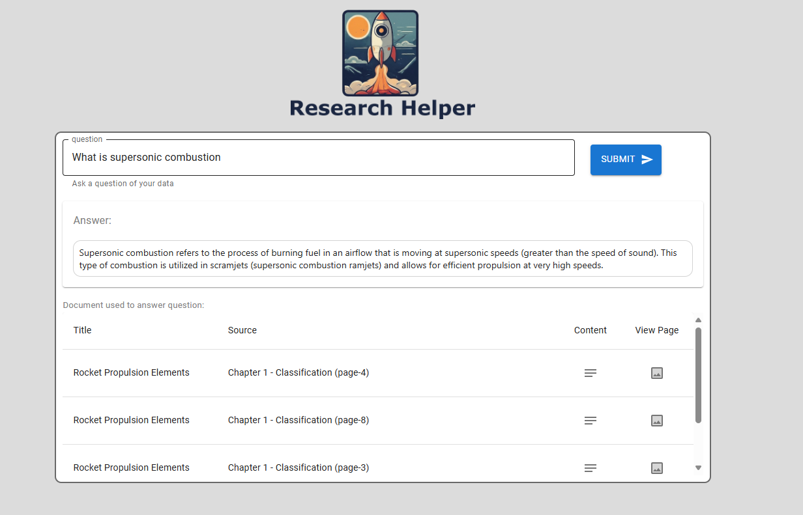
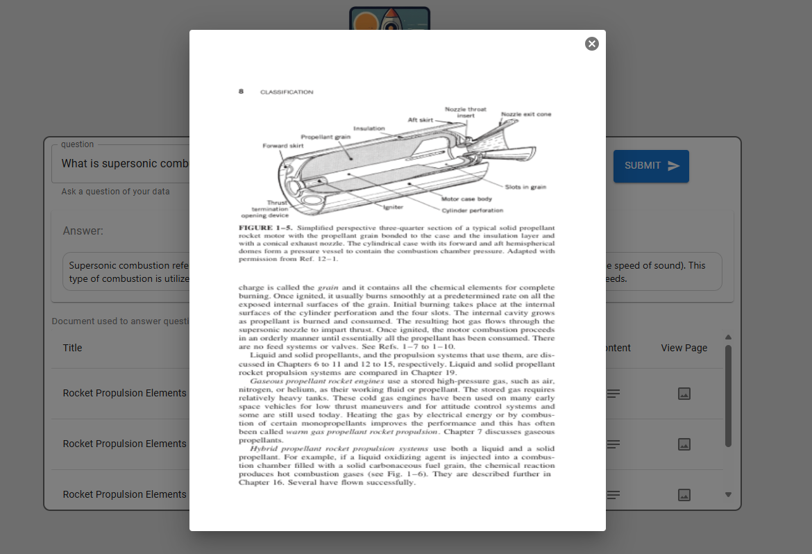

> [!WARNING]  
> **This project is currently in active development and may contain breaking changes.**  
> Updates and modifications are being made frequently, which may impact stability or functionality. This notice will be removed once development is complete and the project reaches a stable release.


# Designing a Robust and Secure GenAI RAG Architecture with React, Python FastAPI, and Azure

## Overview

This project provides a guide to operationalizing a Generative AI (GenAI) solution on Azure using a Retrieval-Augmented Generation (RAG) architecture. It leverages key Azure components, including Azure CosmosDB for MongoDB VCore for vector storage and Azure OpenAI for model inference, while integrating a full-stack setup with React and Python. Designed with an emphasis on security, scalability, and user experience, the solution adheres to best practices for deploying RAG workflows on Azure. It incorporates managed identities, private endpoints, and firewall restrictions to ensure robust data and endpoint protection.

Automated deployment is managed via Bicep templates and Azure CLI, ensuring a consistent and repeatable infrastructure setup. Building on [LangChain RAG with React, FastAPI, and Cosmos DB Vector](https://stochasticcoder.com/2024/02/27/langchain-rag-with-react-fastapi-cosmos-db-vector-part-1/), it adds Azure OpenAI, enhanced logging, networking, and security configurations for an enterprise-ready GenAI solution that handles secure data, efficient retrieval, and seamless user interactions in real-world applications.


## Key Features

- **RAG Architecture**: Implements a Retrieval-Augmented Generation workflow, enhancing GenAI capabilities with a vectorized retrieval layer for contextually relevant responses.
- **CosmosDB Vector Store**: Utilizes CosmosDB for scalable and efficient storage of embeddings, supporting fast and reliable retrieval of data relevant to user queries.
- **Azure OpenAI**: Integrates OpenAI models to enable high-quality generative responses and insights.
     - Implements the LangChain with Azure OpenAI Server.
- **React Frontend**: Provides an interactive and responsive user interface for a seamless experience.
    - Integrates Node.js for server-side logic and connecting to the FastAPI backend.
   
    - Display documents retrieved through Azure AI Search's similarity search.
- **Python Backend**: Manages server-side processing, API orchestration, and integration with Azure services.
- **Event Driven Document Processing**: Use Azure Functions to create vector embeddings in Azure Cosmos DB for MongoDB VCore, triggered by document uploads.
- **Infrastructure as Code**: Uses Bicep and Azure CLI to deploy, manage, and scale resources consistently and securely across environments.

## Architecture


The architecture of this project includes:

- **Frontend**: The user interface is developed using React, ensuring a responsive and interactive experience. This allows users to engage with the application intuitively, providing real-time feedback and dynamic content updates.
- **Backend**: The backend is implemented in Python, utilizing FastAPI for efficient handling of AI logic and data processing. Azure Functions are employed to manage event-driven functions, allowing for scalable and responsive execution as user interactions occur.
- **Database**: Azure Cosmos DB for MongoDB VCore serves as the database solution, optimized for vector search capabilities. This enables fast and efficient retrieval of data, facilitating the application's AI functionalities.
- **AI Models**: The project incorporates the Azure OpenAI Service, which provides advanced generative text and embedding models. These models enhance the application’s ability to produce high-quality, contextually relevant responses based on user input.

## Importance of Private Endpoints

**Private endpoints** play a critical role in ensuring the security and integrity of the deployed solution. Private endpoints enable secure and private communication between Azure resources by extending a virtual network to the service. Here's why private endpoints are essential for this architecture:

### 1. **Enhanced Security**
Private endpoints eliminate the need for public internet exposure, reducing the attack surface and safeguarding data from unauthorized access. By using private IP addresses, all interactions with services like Azure CosmosDB for MongoDB VCore, Azure Storage, and Azure OpenAI occur within your virtual network.

### 2. **Data Protection**
By routing traffic through private endpoints, sensitive data stays within the trusted boundaries of your Azure Virtual Network (VNet). This ensures compliance with industry standards and regulatory requirements for data security.

### 3. **Minimized Risk of Data Exfiltration**
Private endpoints prevent data from being accessed or intercepted over the public internet. This is particularly important when dealing with embeddings, vectorized data, and AI model inference results.

### 4. **Integration with Network Security Tools**
Private endpoints can be combined with additional Azure security measures, such as **network security groups (NSGs)** and **Azure Firewall**, to provide a multi-layered defense strategy.

### 5. **Consistent and Predictable Performance**
By keeping traffic within Azure's backbone network, private endpoints ensure low-latency, high-throughput communication, which is vital for RAG workflows requiring real-time data retrieval and inference.

### Implementation in This Project
This solution leverages private endpoints for all critical services, including:
- **Azure CosmosDB for MongoDB VCore**: Ensuring secure access to vector storage.
- **Azure Storage**: Protecting uploaded documents and embedding files.
- **Azure OpenAI**: Securing communication with AI models for inference.

For more detailed guidance on configuring private endpoints, refer to [Azure Private Endpoint documentation](https://learn.microsoft.com/en-us/azure/private-link/private-endpoint-overview).


## Requirements
- Azure subscription for deploying Azure GenAI RAG Application.
- [Azure CLI](https://learn.microsoft.com/en-us/cli/azure/get-started-with-azure-cli) (Command Line Interface)
- Node.js 20.11.1 installed in your development environment.
    - Please follow the steps outlined [here](https://stochasticcoder.com/2024/03/06/langchain-rag-with-react-fastapi-cosmos-db-vectors-part-3/#h-install-node-js) to download and install Node.JS.
- Python 3.11.4 installed on development environment.
- An IDE for Development, such as [VS Code](https://code.visualstudio.com/download)


## Usage

Follow these steps to set up and deploy the solution:

### 1. Clone the Repository from GitHub:  
Begin by cloning the repository to your local machine using the following command:

```bash
git clone https://github.com/jonathanscholtes/Azure-AI-RAG-Architecture-React-FastAPI-and-Cosmos-DB-Vector-Store.git
cd Azure-AI-RAG-Architecture-React-FastAPI-and-Cosmos-DB-Vector-Store
```

### 2. Deploy the Solution Using Bicep:  
Navigate to the deployment directory:

```bash
cd infra
```

Then, use the following PowerShell command to deploy the solution. Make sure to replace the placeholders with your actual subscription name, Azure Region (ResourceGroupLocation), CosmosDB for MongoDB vCore username, and password:

**PowerShell**
```bash
.\deploy.ps1 -Subscription '[Subscription Name]' -Location 'southcentralus' -CosmosadminUsername '[Username to create for CosmosDB]' -CosmosadminPassword '[Password to Create for CosmosDB]'
```

This script will provision the necessary resources in your Azure subscription according to the specified parameters. The deployment may take upto **30 minutes** to provision all Azure resources.

### 3. Configure Storage Account Access:  
After deployment, it's essential to allow access to the Storage Account facilitate document uploads for embedding creation. To do this, you will need to add your client IP address to the Storage Account’s firewall settings. This ensures that your local environment can communicate with the Azure services properly.

- Log in to the Azure portal.
- Navigate to your Storage Account.
- Under the **Networking** section, locate the **Firewall and virtual networks** settings.
- Add your current client IP address to the list of allowed addresses.



### 4. Upload Documents for Embedding Creation:

Upload the JSON files from the [documents](documents) directory to the **load** container of the Azure Storage Account. The Json files contain the text and images of the reference material used in this knowledge RAG example.



### 5. Validate Embedding Load in Azure CosmosDB for MongoDB vCore
To verify the successful loading of the documents, use [MongoDB Compass](https://www.mongodb.com/products/tools/compass) or a similar tool.

##### Configure Azure CosmosDB for MongoDB vCore Access:
To Validate with [MongoDB Compass](https://www.mongodb.com/products/tools/compass) you will need to add your client IP address to Azure CosmosDB for MongoDB vCore firewall settings.

- Log in to the Azure portal.
- Navigate to your Azure CosmosDB for MongoDB vCore.
- Under the **Networking** section, locate the **Public access** settings.
- Add your current client IP address to the list of allowed addresses.

##### Connect with MongoDB Compass:

Retreive connection string for Azure CosmosDB:
- Log in to the Azure portal.
- Navigate to your Azure CosmosDB for MongoDB vCore.
- Under the **Settings** section, select **Connections strings**
- Copy connection string for new connection with MongoDB Compass

Once connected you will see that 120 documents loaded into Azure CosmosDB for MongoDB vCore:



### 6. GenAI Application

#### Validate API Status

After deployment, it may take a few minutes for all services to initialize. Before launching the web application, it is recommended to verify that the API is operational. 

To do this, navigate to the deployed API endpoint at:  
`https://api-vectorsearch-demo-[random].azurewebsites.net`

If the API is functioning correctly, the page should display the status message: **'running'**.  
This step ensures that the backend services are properly configured and ready for use.



#### React Web Application
Access the Azure Web App hosting the React user interface by navigating to its assigned domain:
`https://web-vectorsearch-demo-[random].azurewebsites.net`

 Once the application loads, test its functionality by submitting the default question, "What is supersonic combustion?"

Upon submission, you should see the following results displayed:

- **Generated Response**: A detailed explanation or summary generated by the AI, outlining the principles of supersonic combustion.
- **Relevant Documents**: A list of contextually relevant documents retrieved from the Cosmos DB vector store, each contributing to the AI's response.

 This initial query confirms that the application is successfully retrieving, processing, and displaying data as designed, allowing you to explore additional questions or further customize the solution.



Selecting the returned document pages will display the page images from the Azure Storage Account:




## Clean-Up

After completing testing, ensure to delete any unused Azure resources or remove the entire Resource Group to avoid incurring additional charges.

### Resource Purge for Redeployment

If you plan to delete and redeploy this solution, you may need to manually purge **Azure OpenAI** service.

#### Azure OpenAI Purge

To permanently delete an Azure OpenAI or other Azure AI service, follow [these steps](https://learn.microsoft.com/en-us/azure/ai-services/recover-purge-resources?tabs=azure-portal#purge-a-deleted-resource):

1. **Navigate to the Azure AI Service Hub**:  
   Go to the hub of the Azure AI service associated with the deleted resource. For instance, if you need to purge an "Anomaly Detector" resource, search for "Anomaly Detector" in the Azure portal search bar, select the service, and then choose **Manage Deleted Resources** from the menu.

2. **Select the Subscription and Deleted Resource**:  
   In the **Manage Deleted Resources** section, choose the relevant subscription from the dropdown list, then locate and select the deleted resource(s) you wish to purge.

3. **Purge the Resource**:  
   Click **Purge** to permanently delete the selected resource(s). Be aware that purging is irreversible and removes all associated configurations and data for the resource.

## License
This project is licensed under the [MIT License](MIT.md), granting permission for commercial and non-commercial use with proper attribution.

## Support
For any questions or issues, please [open an issue](https://github.com/jonathanscholtes/Azure-AI-RAG-Architecture-React-FastAPI-and-Cosmos-DB-Vector-Store/issues) on GitHub or reach out to the project maintainers.

## Disclaimer
This demo application is intended solely for educational and demonstration purposes. It is provided "as-is" without any warranties, and users assume all responsibility for its use.
